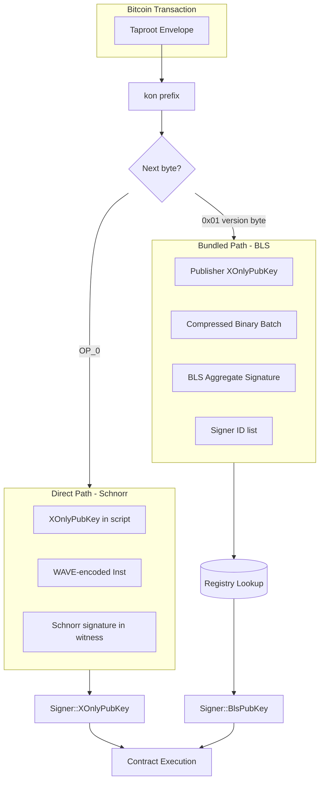

# BLS Signature Integration Plan

## Executive Summary

This plan integrates BLS signature aggregation into the Kontor indexer as specified in the Scalability spec. 

## **Architecture Overview**

The indexer will support two parallel signing flows:



## **Phase 0: Add Dependencies**

- *File: core/Cargo.toml*

Add workspace dependencies:

```
[workspace.dependencies]
# ... existing dependencies ...
blst = { version = "=0.3.14", features = ["portable"] }
zstd = "=0.13.2"
```

- *File: core/indexer/Cargo.toml*

Add to dependencies:

```
blst = { workspace = true }
zstd = { workspace = true }
```

Note: `postcard` is already present in the workspace.

## **Phase 1: Extend Signer Type**

- *File: core/indexer-types/src/lib.rs*

Add a new `BlsPubKey` variant to the `Signer` enum:

```
pubenumSigner {
Core(Box<Signer>),
XOnlyPubKey(String),
BlsPubKey {
id:u32,// Registry ID (4 bytes)
pubkey:String,// Hex-encoded compressed BLS pubkey (96 bytes -> 192 hex chars)
    },
ContractId {id:i64,id_str:String },
Nobody,
}
```

Update the `Deref` implementation so `BlsPubKey` returns the pubkey string (hex), preserving compatibility with `ctx.signer()` in contracts and logs:

```
implcore::ops::DerefforSigner {
typeTarget=str;
fnderef(&self)->&Self::Target {
matchself {
Self::Nobody=>"nobody",
Self::Core(_)=>"core",
Self::XOnlyPubKey(s)=>s,
Self::BlsPubKey {pubkey,.. }=>pubkey,
Self::ContractId {id_str,.. }=>id_str,
        }
    }
}
```

### **BLS Scheme Decision (Critical)**

The scalability spec specifies a **48-byte aggregate signature** overhead. This means Kontor uses the **BLS12-381 min_sig scheme**:

`| Component | Size | Location |`

`|-----------|------|----------|`

`| Signature | 48 bytes | G1 (compressed) |`

`| Public key | 96 bytes | G2 (compressed) |`

`| Aggregate signature | 48 bytes | G1 (compressed) |`

**Why min_sig:**

- Minimizes on-chain aggregate signature size (48 bytes regardless of batch size)
- Matches the TPS benchmarks in the scalability spec
- Each signer's public key (96 bytes) is stored in the registry, not on-chain per operation

**Domain Separation Tag (DST):**

```
pubconst BLS_DST:&[u8]=b"BLS_SIG_BLS12381G1_XMD:SHA-256_SSWU_RO_NUL_";
```

## **Phase 2: Signer Registry Schema and State**

- *File: core/indexer/src/database/sql/schema.sql*

Add registry table for **BLS pubkey** to **signer id** mapping.

### **Determinism Requirements (from Scalability Spec)**

From the spec: "Registry state must be identical across all indexers:

- IDs assigned sequentially on first use
- Deterministic: all indexers derive identical mappings from the same blocks
- Reorgs require registry state rollback

```sql
-- Signer registry: maps BLS public keys to compact 4-byte IDs
CREATE TABLE IF NOT EXISTS signer_registry (
  id INTEGER PRIMARY KEY,              -- Auto-assigned sequential ID (no AUTOINCREMENT!)
  bls_pubkey BLOB NOT NULL UNIQUE,     -- 96 bytes compressed G2 point (min_sig scheme)
  first_seen_height INTEGER NOT NULL,
  first_seen_tx_index INTEGER NOT NULL,
  FOREIGN KEY (first_seen_height) REFERENCES blocks (height) ON DELETE CASCADE
);
CREATE INDEX IF NOT EXISTS idx_signer_registry_pubkey ON signer_registry (bls_pubkey);
```

**Critical: No AUTOINCREMENT**

SQLite's `INTEGER PRIMARY KEY` without `AUTOINCREMENT`:

- Reuses IDs after rollback (max id decreases when highest rows are deleted)
- Ensures deterministic ID assignment across all indexers after reorgs

Store pubkeys as `BLOB` (96 bytes) to avoid hex storage overhead; convert to hex only at API/runtime boundary.

### **Contract Registry**

The existing `contracts` table already assigns `id INTEGER PRIMARY KEY` and cascades on reorg:

```sql
REATE TABLE IF NOT EXISTS contracts (
  id INTEGER PRIMARY KEY,
  name TEXT NOT NULL,
  height INTEGER NOT NULL,
  tx_index INTEGER NOT NULL,
  size INTEGER NOT NULL,
  bytes BLOB NOT NULL,
  UNIQUE (name, height, tx_index),
  FOREIGN KEY (height) REFERENCES blocks (height) ON DELETE CASCADE
);
```

**Decision:** Reuse `contracts.id` as the compact `contract_id` for `BinaryCall`. No schema changes needed. Add a lookup function:

```rust
pub async fn get_contract_by_id(conn: &Connection, id: u32) -> Result<Option<ContractRow>>
```

**New module: `core/indexer/src/signer_registry.rs`**

```rust
pub struct SignerRegistry {
    cache: HashMap<u32, [u8; 96]>,      // id -> pubkey
    reverse_cache: HashMap<[u8; 96], u32>, // pubkey -> id
}

impl SignerRegistry {
    /// Assign a new ID or return existing one. Must be called in deterministic order.
    pub async fn assign_or_get_id(
        &mut self,
        conn: &Connection,
        pubkey: &[u8; 96],
        height: i64,
        tx_index: i64,
    ) -> Result<u32>;

    /// Lookup pubkey by ID (used during verification)
    pub async fn get_pubkey_by_id(
        &mut self,
        conn: &Connection,
        id: u32,
    ) -> Result<Option<[u8; 96]>>;

    /// Clear cache entries added at or after the given height (for rollback)
    pub async fn rollback_to_height(&mut self, conn: &Connection, height: i64) -> Result<()>;

    /// Rebuild cache from database (called on startup or after rollback)
    pub async fn rebuild_from_db(&mut self, conn: &Connection) -> Result<()>;
}

```

### **Automatic Registration (from Scalability Spec)**

From the spec: "When a new public key first signs a Kontor operation, the indexer automatically assigns it the next sequential registry ID. This is deterministic: all indexers process blocks identically, so they assign the same IDs."

Registration happens during batch processing:

1. For each `BinaryCall` in a batch, check if `signer_id` exists in registry
2. If not, this is an error (signers must be registered before use)
3. **New signer registration:** Occurs when a signer is first seen in a batch's `unique_signer_ids` list

## **Phase 3: Binary Batch Format and Decoding**

**New module: `core/indexer/src/batch.rs`**

The benchmarks assume the following on-chain layout:

- compressed payload contains only concatenated Postcard-encoded calls (no signatures inside compression)
- signatures + signer-id list are accounted as fixed overhead outside compression

To preserve script push boundaries, the BLS batch should store **three pushes** after the version byte:

1. `compressed_calls` (zstd-compressed bytes)
2. `aggregate_signature` (48 bytes)
3. `unique_signer_ids` (raw little-endian `u32` list; length must be a multiple of 4)

Define the in-memory call structure:

```rust
#[derive(Serialize, Deserialize)]
pub struct BinaryCall {
    pub signer_id: u32,
    pub contract_id: u32,
    pub function_index: u16,
    pub args: Vec<u8>,
}
```

Decoding pipeline for batch v1:

1. Read the three pushes (`compressed_calls`, `aggregate_signature`, `unique_signer_ids_bytes`)
2. Validate sizes:
    - `aggregate_signature.len() == 48`
    - `unique_signer_ids_bytes.len() % 4 == 0`
3. Zstd decompress `compressed_calls`
4. Stream-parse the decompressed bytes into `BinaryCall` values using `postcard::take_from_bytes` until exhausted
5. Decode `unique_signer_ids_bytes` into `Vec<u32>` (little-endian)
6. (Optional but recommended) verify `unique_signer_ids` matches the set of `call.signer_id` values (sorted) to prevent malleability / inconsistent overhead accounting

## **Phase 4: Block Parsing Extension**

- *File: core/indexer/src/block.rs*

Add a **new, separate parsing function** for BLS batches. The existing `filter_map` function remains completely unchanged.

```rust
// Existing filter_map() - NO CHANGES
// Continues to handle: "kon" + OP_0 (empty) + WAVE data

// NEW function for BLS batches
pub fn filter_map_bls((tx_index, tx): (usize, bitcoin::Transaction)) -> Option<Vec<Op>> {
    // Parse envelope looking for: ("kon" or "kor") + 0x01 version byte
    // ...
    && let Some(Ok(Instruction::PushBytes(kon))) = insts.next()
    && (kon.as_bytes() == b"kon" || kon.as_bytes() == b"kor")
    && let Some(Ok(Instruction::PushBytes(version))) = insts.next()
    && version.as_bytes() == &[0x01]  // Only match v1 BLS format
    {
        // Collect push boundaries instead of concatenating everything
        // - push #1: compressed_calls
        // - push #2: aggregate_signature
        // - push #3: unique_signer_ids
        let batch = decode_bls_batch_from_pushes(&pushes)?;
        // Returns Vec<Op> with Signer::BlsPubKey for each call
    }
}
```

The Bitcoin follower calls both parsers:

1. `filter_map()` - existing legacy path (unchanged)
2. `filter_map_bls()` - new BLS batch path

The publisher's XOnlyPubKey (from the Taproot script) is recorded for the Bitcoin transaction but not used as the operation signer - each `BinaryCall.signer_id` determines the signer after registry lookup.

## **Phase 5: BLS Aggregate Verification**

**New module: `core/indexer/src/bls.rs`**

Add `blst` crate dependency for BLS12-381 verification and use the **min_sig** scheme:

```rust
use blst::min_sig::{PublicKey, Signature};

pub fn verify_batch(
    calls: &[BinaryCall],
    aggregate_signature: &[u8; 48],
    signer_pubkeys: &impl Fn(u32) -> Option<[u8; 96]>,
) -> Result<bool> {
    // 1. Collect (pubkey, message) pairs from calls, in-order
    //    Each message MUST be domain-separated and canonical.
    //
    //    Recommendation: message = b\"KONTOR_OP_V1\" || <exact postcard bytes of BinaryCall>
    //    where <exact postcard bytes> are the bytes consumed from the decompressed stream
    //    (not a re-serialization), so signatures are byte-for-byte reproducible.

    // 2. Parse pubkeys (96 bytes) and signature (48 bytes)
    // 3. Call blst aggregate verification over the full (pk, msg) list
}
```

Domain separation:

- Define a single DST constant in one place (both Portal/bundler tooling and indexer must match).
- Example: `DST = b\"KONTOR_BLS_MIN_SIG_V1\"`

The verification happens once per batch before executing any operations. If aggregate verification fails, the entire batch is rejected.

## **Phase 6: Reactor Integration**

- *File: core/indexer/src/reactor/mod.rs*

Modify `block_handler` to:

1. Detect batch transactions during parsing
2. Verify BLS aggregate signature before processing
3. For each `BinaryCall` in batch:
    - Resolve `signer_id` to BLS pubkey via registry
    - Resolve `contract_id` to `ContractAddress`
    - Resolve `function_index` to function name via contract WIT
    - Deserialize `args` based on function signature
    - Execute with `Signer::BlsPubKey { id, pubkey }`

The existing sequential execution model is preserved - operations within a batch execute in order just like individual transactions.

Important missing piece in the current plan (must be addressed):

- The current runtime execution entrypoint expects a WAVE `expr: String` (`runtime.execute(..., expr)`).
- The binary format carries `(function_index, args: Vec<u8>)`.
- Therefore, we must add a runtime execution path that can invoke an export by index and decode Postcard args against the WIT signature.

Concrete deliverable:

- Add `Runtime::execute_binary(signer: Option<&Signer>, contract: &ContractAddress, function_index: u16, args: &[u8]) -> Result<...>`
- Keep the legacy WAVE execution path unchanged.

## **Phase 7: Contract ID Registry**

Similar to the signer registry, contracts need compact IDs for the binary format:

The current schema already assigns `contracts.id INTEGER PRIMARY KEY` and rolls back contracts on reorgs via

`FOREIGN KEY (height) REFERENCES blocks(height) ON DELETE CASCADE`.

Plan decision:

- Use `contracts.id` as the compact `contract_id` for `BinaryCall` (it is already a compact integer identifier).
- Add an explicit index if needed (SQLite will already index the INTEGER PRIMARY KEY, but keeping an index here is harmless if queries are frequent).`CREATE INDEX IF NOT EXISTS idx_contracts_id ON contracts (id);`

If we ever need contract IDs to include *non-deployed* contracts or other identifiers, introduce a dedicated contract registry table; until then, reusing `contracts.id` minimizes moving parts.

## **Phase 8: Function Resolution**

**New module: `core/indexer/src/function_registry.rs`**

Map `(contract_id, function_index)` to function names:

```rust
pub fn resolve_function(
    contract_id: u32,
    function_index: u16,
    runtime: &Runtime,
) -> Result<(ContractAddress, String)> {
    let contract = get_contract_by_id(contract_id)?;
    let wit = parse_wit(&contract.bytes)?;
    let func_name = wit.exports.get(function_index as usize)?;
    Ok((contract.address(), func_name))
}
```

Stability requirement:

- The function index ordering must be defined unambiguously and be stable across toolchains.
- Recommendation: define the ordering as the order of exported functions in the contract's compiled component metadata (as parsed by `wit-parser` / component metadata), and write a regression test that the ordering for a known contract is stable.

## **Key Design Decisions**

1. **No changes to legacy path**: The existing `filter_map()` function and Schnorr/WAVE parsing remain completely unchanged. Legacy uses `"kon"` + `OP_0` (original format, no version concept). BLS support is purely additive via a new `filter_map_bls()` function that matches `"kon"` + `0x01` version byte.
2. **Registry ID assignment**: Sequential on first use, deterministic across all indexers. Rollback via foreign key cascade.
3. **Signer identity**: Contracts receive the BLS pubkey string via `ctx.signer()`, transparent to contract logic
4. **Batch verification**: All-or-nothing - if aggregate verification fails, entire batch is rejected
5. **Mixed blocks**: A single Bitcoin block can contain both legacy Schnorr transactions and BLS batch transactions

## **Dependencies**

Add to the indexer workspace dependencies (follow repo pinning style; prefer a fixed `=` version):

```
blst = { version = "=0.3.14", features = ["portable"] }
zstd = "0.13"
# postcard already present
```

## **Testing Strategy**

1. **Unit tests**:
    - Signer registry ID assignment and lookup (including rollback behavior via deleting blocks)
    - BLS batch decoding from script pushes (size checks, malformed cases)
    - BLS signature verification (min_sig) with generated vectors
2. **Integration tests**:
    - Mixed blocks with legacy `filter_map()` transactions and BLS batch transactions
    - Rollback correctly removes signer registry entries (and reuses ids deterministically)
    - End-to-end: a BLS batch with multiple signers executes calls with the expected `ctx.signer()`
3. **Reorg tests**:
    - Signer registry state consistency after reorg (ids restored)
    - Batched transactions correctly removed on rollback, including any contract state and results written during their execution

# BLS Signature Aggregation + Binary Batch Execution (Kontor Indexer)

## Goals

- **Preserve the current direct path**: existing `"kon"` Taproot envelope + Postcard `Inst` payload + Schnorr/Taproot authorization continues to work.
- **Add a new bundled path**: a single Bitcoin tx can carry a compressed batch of many operations authorized by a **single BLS aggregate signature**, verified by the indexer (not contracts).
- **Match the actual ecosystem implementation**:
    - Portal + Storage Node already use `blst::min_sig` and sign/verify with a DST of `b"HORIZON_PORTAL_BLS_DST"`for *Portal-specific* agreement/proof messages.
    - The Scalability spec + benchmark model assume **48-byte BLS signatures** and **4 bytes per unique signer**overhead.

## Key corrections vs the current plans

- **Protocol tag mismatch (docs vs code)**:
    - Code uses `b"kon"` today (see `[core/indexer/src/block.rs](core/indexer/src/block.rs)` and `[core/indexer/src/api/compose.rs](core/indexer/src/api/compose.rs)`), while the whitepaper/spec text uses `"kor"`.
    - This plan treats `*"kon"` as canonical for now to avoid cross-repo breakage; if you want to switch to `"kor"`, do it before release and update all composing/parsing code in lockstep.
- **BLS scheme**:
    - The Portal/Storage Node and the benchmarks are consistent with `*blst::min_sig**` (signature/aggregate = 48 bytes, public key = 96 bytes).
- **Batch format discriminator**:
    - **versioning must live inside the payload bytes** (e.g., a magic prefix + version) unless we also change the envelope builder.
- **Registry + signer identity**:
    - For protocol-level BLS batching, the registry must key off **BLS pubkeys (96-byte min_sig)** and enforce **Proof of Possession (PoP)** at registration to prevent rogue-key attacks.
    - The legacy direct Schnorr/WAVE path still exposes the Tapscript x-only pubkey as the on-chain signer; that identity is separate unless/until we add an explicit binding mechanism.
- **Determinism risk in current follower**:
    - The Bitcoin follower collects relevant txs using Rayon `filter_map` (see `[core/indexer/src/bitcoin_follower/rpc.rs](core/indexer/src/bitcoin_follower/rpc.rs)`, `[core/indexer/src/bitcoin_follower/zmq.rs](core/indexer/src/bitcoin_follower/zmq.rs)`). We must ensure **transactions are processed in `tx_index` order**, or registry IDs and contract state can become nondeterministic.

## Proposed design

### 1) Deterministic transaction ordering (must-fix)

- **Change**: after parallel parsing, **sort the resulting `Vec<Transaction>` by `Transaction.index**` (or change the collection strategy to preserve order) in:
    - `[core/indexer/src/bitcoin_follower/rpc.rs](core/indexer/src/bitcoin_follower/rpc.rs)`
    - `[core/indexer/src/bitcoin_follower/zmq.rs](core/indexer/src/bitcoin_follower/zmq.rs)`

### 2) Registry tables

Add new tables to `[core/indexer/src/database/sql/schema.sql](core/indexer/src/database/sql/schema.sql)`:

- `*signer_registry**` (deterministic signer registry for BLS batching)
    - `id INTEGER PRIMARY KEY` (no `AUTOINCREMENT`)
    - `bls_pubkey BLOB NOT NULL UNIQUE` (96 bytes, `blst::min_sig::PublicKey::from_bytes`)
    - `first_seen_height INTEGER NOT NULL`
    - `first_seen_tx_index INTEGER NOT NULL`
    - FK `first_seen_height -> blocks(height) ON DELETE CASCADE`
- `*signer_nonces**` (replay protection for batched operations)
    - `signer_id INTEGER NOT NULL` (FK -> `signer_registry.id`)
    - `nonce INTEGER NOT NULL` (u64 stored as INTEGER)
    - `height INTEGER NOT NULL` (FK -> `blocks(height) ON DELETE CASCADE`)
    - `UNIQUE(signer_id, nonce)`

Rationale:

- Treat **BLS pubkeys as signer identities** for aggregation and uses compact IDs (`u32`) in payloads.
- `signer_nonces` provides chain-level replay protection and automatically rolls back on reorgs via CASCADE.

### 3) Rogue-key defense + inline registration

### 3.1 Rogue-key defense: Proof of Possession (PoP)

Allowing a bundler to introduce arbitrary BLS pubkeys “on first use” without proof of key ownership enables a **rogue-key attack**. To prevent this, require a **Proof of Possession** for every newly-registered BLS pubkey:

- **PoP message bytes**: `b"KONTOR-POP-V1" || bls_pubkey_bytes`
- **Verification**: the batch’s aggregate signature must cover a valid signature on this PoP message for each newly introduced pubkey (constructed and checked as part of the batch aggregate verification in Section 7).
- **Subgroup validation**: PoP verification must validate the pubkey is in the correct subgroup (see Section 7).

The PoP signature is **not carried separately on-chain**: it is included as one of the signatures that contribute to the single 48-byte aggregate signature.

### 3.2 Inline registration: `new_signers` + `BundleIndex`

Requiring a separate “registration transaction” before a signer can appear in a batch increases onboarding cost. Instead, add inline registration to the bundle format:

- The bundle includes a `new_signers` array of raw 96-byte BLS pubkeys.
- Operations can reference signers either by an existing registry ID (`RegistryId(u32)`) or by index into `new_signers`(`BundleIndex(u8)`).
- The indexer processes registrations first (verifying PoPs, assigning sequential IDs deterministically), then resolves `BundleIndex` references to those newly assigned IDs before executing operations.

### 4) BLS batch payload format (inside the existing `"kon"` envelope)

Define a versioned payload that can be distinguished from Postcard-encoded `Inst`.

- **Batch payload V1 (raw bytes)**:
    - `magic = b"KBL1"` (4 bytes)
    - `compressed_calls_len: u32_le`
    - `compressed_calls: [u8; compressed_calls_len]` (zstd level 15; content is concatenated postcard `BinaryCallV1` bytes)
    - `aggregate_signature: [u8; 48]` (`blst::min_sig::Signature::from_bytes`)
    - `new_signers_len: u32_le`
    - `new_signers: [u8; new_signers_len]` (concatenated 96-byte compressed BLS pubkeys; length must be a multiple of 96)

Notes:

- This format supports **inline registration** (new signers appear without a prior on-chain registration tx).
- PoP signatures do **not** add on-chain bytes; they are included in the single aggregate signature’s verification set.
- The benchmark model in `Documentation/benchmarks/src/main.rs` remains directionally correct for steady-state batches; onboarding batches will be slightly larger due to `new_signers`.

### 5) Block parsing changes

Update `[core/indexer/src/block.rs](core/indexer/src/block.rs)` `filter_map` to support both formats:

- Keep the existing Tapscript envelope match:
    - `[xonly] OP_CHECKSIG OP_FALSE OP_IF "kon" OP_0 <push-bytes...> OP_ENDIF`
- Change the inner payload handling:
    - Concatenate pushes into `data` (as now).
    - Try `postcard::from_bytes::<Inst>(&data)`:
        - If OK: emit legacy `Op` (current behavior).
        - If not OK and `data` starts with `b"KBL1"`: emit a **new op variant** (see next section) representing a BLS batch.
- Also fix `op_index` handling in block execution (currently always `0` in `[core/indexer/src/reactor/mod.rs](core/indexer/src/reactor/mod.rs)`); when a batch expands into multiple calls, each must get a distinct `op_index`.

### 6) New op type(s) for BLS batches

Extend `[core/indexer-types/src/lib.rs](core/indexer-types/src/lib.rs)` to carry batched calls without forcing immediate resolution:

- Add `Op::BlsBatch { metadata, payload: Vec<u8> }` (payload is the raw `KBL1...` bytes).
    - `metadata.signer` should remain the publisher x-only pubkey (from the Tapscript key) for traceability.

The batch is later expanded + verified in the reactor.

### 7) BLS verification + batch expansion in the reactor

Update `[core/indexer/src/reactor/mod.rs](core/indexer/src/reactor/mod.rs)`:

- When encountering `Op::BlsBatch`:
    - Parse payload and validate:
        - `new_signers_len % 96 == 0`
        - `aggregate_signature.len() == 48`
    - zstd-decompress `compressed_calls`.
    - Stream-parse concatenated `BinaryCallV1` bytes using `postcard::take_from_bytes`, **retaining the exact bytes slice consumed for each call** for signature verification.
    - Resolve each call’s signer public key:
        - `SignerRef::RegistryId(id)`: lookup `bls_pubkey` in `signer_registry`.
        - `SignerRef::BundleIndex(i)`: use `new_signers[i]` (bounds-check `i < new_signers_count`).
    - Construct the aggregate verification set (deterministic order):
        - For each `new_signers[i]` (in `new_signers` order), add a PoP pair:
            - `msg = b"KONTOR-POP-V1" || new_signers[i]`
            - `pk = new_signers[i]`
        - For each operation at position `op_index` in the decompressed call list (in order), add an operation pair:
            - `msg = b"KONTOR-OP-V1" || u32_le(op_index) || <binary_call_bytes>`
            - `pk = signer_pk(call.signer)`
            - `<binary_call_bytes>` are the exact postcard bytes of `BinaryCallV1` (must include `nonce` and `gas_limit`, see Section 8).
    - Verify `aggregate_signature.aggregate_verify(...)` against **all** PoP + op message pairs.
    - If verification succeeds:
        - Inline registration: insert each `new_signer` into `signer_registry` in `new_signers` order (reject if already registered) and record the assigned `signer_id` for `BundleIndex(i)`.
        - Resolve `BundleIndex(i)` references to their newly assigned `RegistryId(signer_id)` before execution.
        - Replay protection: reject the batch if any `(signer_id, nonce)` has already appeared in `signer_nonces` (or if there are duplicates within the batch). Nonces are arbitrary `u64` values (not required to be sequential). Otherwise insert nonce rows linked to the current `blocks.height`.
        - Expand into per-call execution items.
- **DST for protocol-level BLS**:
    - Keep Portal’s DST (`b"HORIZON_PORTAL_BLS_DST"`) for Portal HTTP/agreement messages only. (OPEN QUESTION HERE???)
    - For protocol batching, use a single BLS DST constant compatible with `blst::min_sig` aggregate verification (recommendation: the standard ciphersuite DST `b"BLS_SIG_BLS12381G1_XMD:SHA-256_SSWU_RO_NUL_"`).
    - **Domain separation for PoP vs operations** is enforced by the message prefixes (`KONTOR-POP-V1` vs `KONTOR-OP-V1`), because `blst` aggregate verification takes only one DST value.
    - **Subgroup validation**: ensure subgroup/key validation is explicitly enabled in both PoP handling and batch verification (e.g., `PublicKey::key_validate()` on deserialization and `aggregate_verify(..., pk_validate = true)`).

### 8) Binary call execution

The Scalability spec’s target execution path is:

- `BinaryCallV1 { signer: SignerRef, contract_id: u32, function_index: u16, args: Vec<u8>, nonce: u64, gas_limit: u64 }` where `args` is Postcard bytes.

`SignerRef` supports inline registration:

- `RegistryId(u32)`
- `BundleIndex(u8)` (index into the bundle’s `new_signers` array)

Implementation plan (phased):

- **Phase A (plumbing first)**:
    - Add `BinaryCallV1` + `SignerRef` structs/enums in the indexer crate and plumb them through decompression/parsing/verification.
    - Resolve `contract_id` using `contracts.id` (already exists in DB).
    - Resolve `SignerRef` into a concrete `signer_id` and signer public key for execution.
    - For runtime execution, pass a stable signer identity string (choose one and document it):
        - `Signer::BlsPubKey { id, pubkey_hex }` (full pubkey available to contracts), or
        - `Signer::XOnlyPubKey(format!("@{}", id))` to use compact registry IDs at the contract layer.
- **Phase B (full binary invocation)**:
    - Implement `Runtime::execute_binary(...)` in `[core/indexer/src/runtime/mod.rs](core/indexer/src/runtime/mod.rs)`:
        - Resolve `function_index -> export name` deterministically from the contract’s interface.
        - Decode `args` into `wasmtime::component::Val` values via a schema-driven Postcard decoder built from component/WIT types.
        - Call the function directly without WAVE text parsing.
- **Phase C (API support for bundlers)**:
    - Add an API endpoint (under `[core/indexer/src/api/](core/indexer/src/api/)`) that returns:
        - contract_id for a given `ContractAddress`
        - stable function index mapping for a contract (export order)

### 9) Portal + Storage Node alignment (cross-repo, but necessary end-to-end)

- Portal/Storage Node currently sign agreement-related messages with:
    - message bytes: `postcard::to_allocvec(&(portal_signing_xpub, instruction))`
    - DST: `b"HORIZON_PORTAL_BLS_DST"`
- Under the protocol-level batching model, those components should eventually:
    - sign protocol operation messages `b"KONTOR-OP-V1" || u32_le(op_index) || <BinaryCallV1 postcard bytes>` with the **protocol DST**, and submit to bundlers.
    - include PoP on first use: `b"KONTOR-POP-V1" || bls_pubkey` (PoP signatures can be aggregated with op signatures).
    - keep `HORIZON_PORTAL_BLS_DST` only for Portal HTTP signatures / Portal-side workflows.

### 10) Wallet key derivation path separation

To prevent cross-protocol/key-reuse attacks, Kontor wallets must derive BLS keys from a **dedicated derivation path** that is separate from Bitcoin Taproot keys.

- **Specify normatively** in:
    - `Documentation/specs/scalability/main.typ`
    - (optionally) `Documentation/specs/whitepaper/main.typ`
- **Recommendation**: follow an EIP-2334 style structure but with Kontor-specific constants:
    - Taproot (Bitcoin): `m/86'/0'/account'/change/address_index`
    - Kontor BLS: `m/12381'/1337'/account'/0'/0'` (example; pick final constants once and treat them as stable)
- **Add test vectors** (seed -> BLS pubkey) so Portal, Storage Node, and wallet tooling can interoperate deterministically.

## Deliverables / Todos

- **deterministic-ordering**: Ensure txs are processed in `tx_index` order within each block (even when parsing in parallel).
- **db-registry**: Add `signer_registry` + `signer_nonces` tables and DB queries.
- **inline-registration + PoP**: Support new signers in a batch via `new_signers` + PoP verification (rogue-key defense).
- **batch-format**: Implement `KBL1` batch encoding/decoding (zstd + aggregate sig + `new_signers`).
- **bls-verify**: Implement `blst::min_sig` aggregate verification over PoP + op message sets (subgroup checks enabled).
- **replay protection**: Enforce `(signer_id, nonce)` uniqueness with DB-backed rollback-safe tracking.
- **block-parser**: Extend `filter_map` to emit a new `Op::BlsBatch` when batch payload is detected.
- **reactor-expansion**: Verify + expand batches into per-call executions; fix `op_index` usage.
- **binary-exec**: Implement schema-driven argument decoding + `Runtime::execute_binary` and function-index resolution.
- **contracts-auth**: Keep `filestorage` node actions keyed by `node_id` (Portal/publisher may be the on-chain signer); do not bind node identity to `ctx.signer()`.
- **wallet spec**: Specify a dedicated BIP-32 derivation path for Kontor BLS keys (separate from Taproot keys) in `Documentation/specs`.
- **tests**: Add unit + integration tests for parsing, PoP, nonce replay rejection, subgroup validation, rollback determinism, and mixed legacy+BLS blocks.

### Footnote: make all `filestorage` calls first-class protocol ops (post-BLS)

You’re right: for `filestorage` we ultimately want **canonical, typed protocol-level call bytes** (not WAVE strings), so the same contract actions can be executed via:

- **Legacy direct path** (Schnorr/Taproot publish): Postcard `Inst` payloads.
- **Batched path** (KBL1): `BinaryCallV1` payloads signed/aggregated with BLS.

What this entails (kept post-BLS so it doesn’t distract from signature plumbing):

- *Define first-class instruction variants for `filestorage` in `Inst**` (legacy path):
    - Add `Inst` variants for each mutating `filestorage` export you care about, minimally:
        - `create-agreement(descriptor)`
        - `join-agreement(agreement_id, node_id)` (this is the on-chain form of Portal’s “join_agreement”)
        - `leave-agreement(agreement_id, node_id)`
        - `verify-proof(proof_bytes)` (this is the on-chain form of Portal’s “send_proof”)
    - In the reactor, execute these by calling the generated typed interface in `[core/indexer/src/runtime/filestorage.rs](core/indexer/src/runtime/filestorage.rs)` rather than going through WAVE text.
- *Map those same actions to `BinaryCallV1**` (batched path):
    - Ensure each `filestorage` action has a stable `(contract_id, function_index)` and a canonical `args` encoding (Postcard bytes matching the WIT argument tuple).
    - Include `nonce` + `gas_limit` in `BinaryCallV1` and therefore in the signed bytes (`KONTOR-OP-V1 || op_index || <BinaryCallV1 bytes>`).
- **Timing / when it should happen**:
    - Do this **after** Section 7–8 plumbing is working (KBL1 parse/verify/expand + `BinaryCallV1` execution), because then “first-class filestorage ops” is mostly an ingestion-format + convenience layer, not foundational BLS work.
    - It becomes the first “real” consumer of the binary call runtime (great for integration tests), but it shouldn’t block getting BLS batching correct first.